# 🎮 Tu proyecto de Unity en GitHub 🎮
## Introducción 👓

En este readme se mostrará la manera correcta de crear un repositorio y como vincular Unity a GitHub, además de algunas técnicas de trabajo. Un repositorio es un espacio de almacenamiento donde se pueden guardar y administrar proyectos de desarrollo de software.

## Instalaciones Previas 📓
Para poder subir tu proyecto es necesario que tengas instalado el siguiente software:

* GitHub Desktop [link de instalación](https://desktop.GitHub.com/)
* Visual Studio Code [link de instalación](https://code.visualstudio.com/download)

Además en necesario tener una cuenta de GitHub. Si aún no la tienes, puedes crear una dando clic [aquí](https://GitHub.com/signup?ref_cta=Sign+up&ref_loc=header+logged+out&ref_page=%2F&source=header-home)

## Creación del repositorio dentro de GitHub Desktop 🛠

Una vez instalado el software, empezaremos creando el repositorio y publicándolo en la web de GitHub. Para hacer esto es necesario vincular tu cuenta de GitHub con la aplicación de GitHub Desktop.

Una vez esté lista la vinculación, ya podremos empezar a crear repositorios locales en nuestro equipo para después subirlos a la nube de GitHub. Para poder hacer esto es necesario seguir los siguientes pasos:

1. El primer paso es que dentro de tu gestor de archivos tengas una carpeta especializada para los repositorios o proyectos de la sociedad. Dentro de esta carpeta vamos a crear el repositorio.
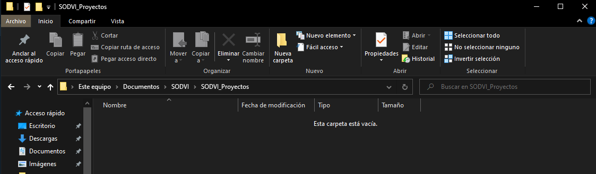

2. Crearemos el repositorio en nuestra aplicación de GitHub. Esto lo haremos siguiendo estos pasos:
    
    2.1. Presionamos el boton de "File" en el lado superior izquierdo.

    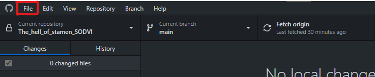

    2.2. Dar clic en el botón "New Repository..."

    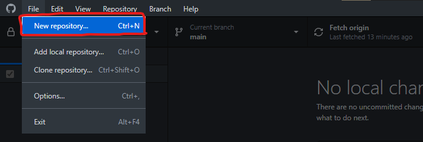

    2.3. Nos saldrá una nueva ventana que nos pedirá rellenar algunos campos de la siguente manera:
    
    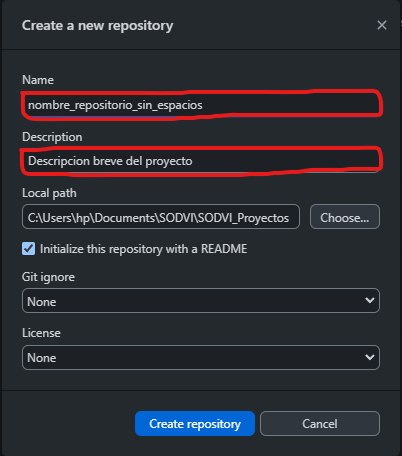

    2.4. El "Local path" es la ruta donde estará guardado el repositorio, por lo que tendremos que poner la ruta de la carpeta que hicimos al principio. Esto es para tener un mejor orden.

    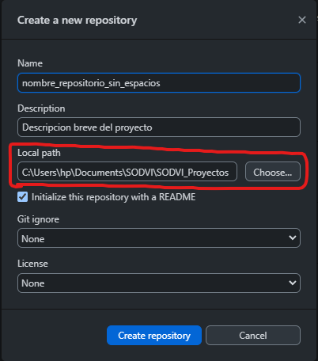

    2.5. Tendremos que marcar la casilla que se muestra a continuación.

    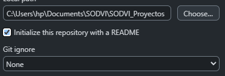

    2.6. La sección del "Git Ignore" es una de las mas importantes de la creacion del proyecto. En esta parte es nesesario seleccionar la opcion de "Unity".

    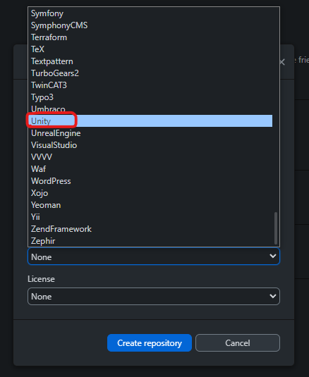

    2.7. Es también importante que no cambien ningún valor en la sección "License".

    2.8. Una vez que terminemos los pasos anteriores, daremos clic en el boton "Create repository".

    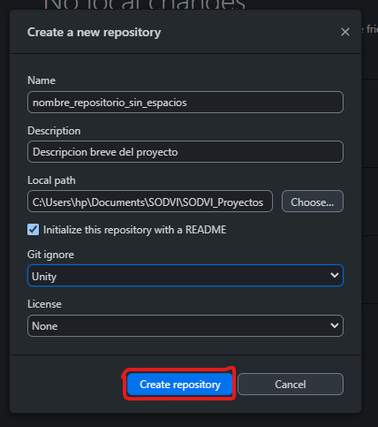

3. Ya tendremos listo el repositorio. Si quieres ver si este se creó de manera correcta, podemos ir a la carpeta que hicimos y podremos ver esta nueva carpeta:
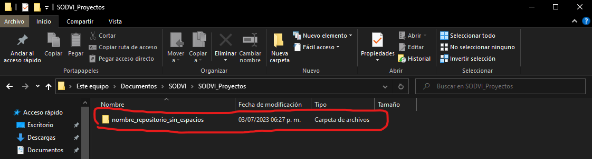
Dentro de esta nueva carpeta podremos ver los archivos que son necesarios para el funcionamiento del repositorio.

4. El repositorio necesita de algunas modificaciones para que funcione de manera correcta. Para esto entraremos en el documento ".gitignore". Se recomienda usar VS Code para la edicion, pero puedes usar el editor de tu preferencia.

    Al abrir el documento nos centraremos en la primera parte de este:
    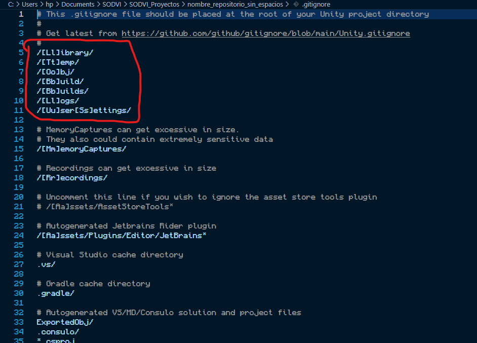

    En esta sección tendremos que borrar lo que está y pegar esta sección de código:

        [Ll]ibrary/
        [Tt]emp/
        [Oo]bj/
        [Bb]uild/
        [Bb]uilds/
        [Ll]ogs/
        [Mm]emoryCaptures/
        [Uu]ser[Ss]ettings/

    Si quieres saber más de que es un .gitignore, puedes dar clic [aquí](https://git-scm.com/docs/gitignore#:~:text=A%20gitignore%20file%20specifies%20intentionally,gitignore%20file%20specifies%20a%20pattern.)

5. Después de esto tendrás que crear una nueva carpeta dentro del repositorio para tu proyecto. Esta puede tener el nombre de tu proyecto. Es aquí donde se guardará el proyecto de Unity.
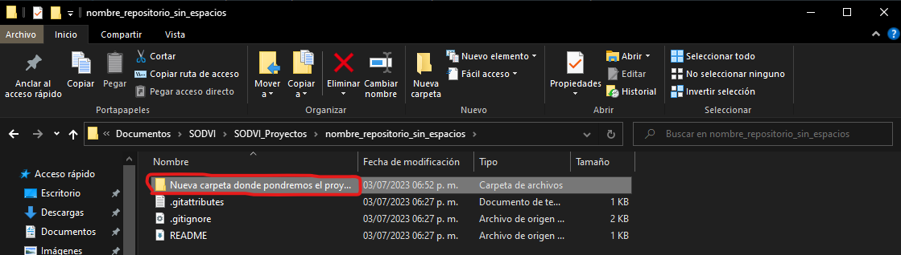
Creamos el proyecto y lo guardamos en esta carpeta.
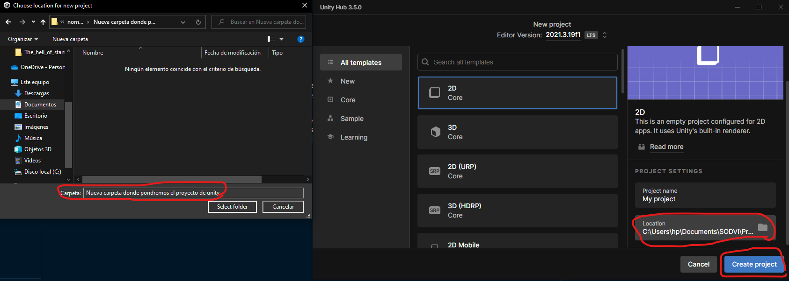

6. Después de crear el proyecto, iremos nuevamente a GitHub Desktop. Podremos ver unos cambios dentro del software:
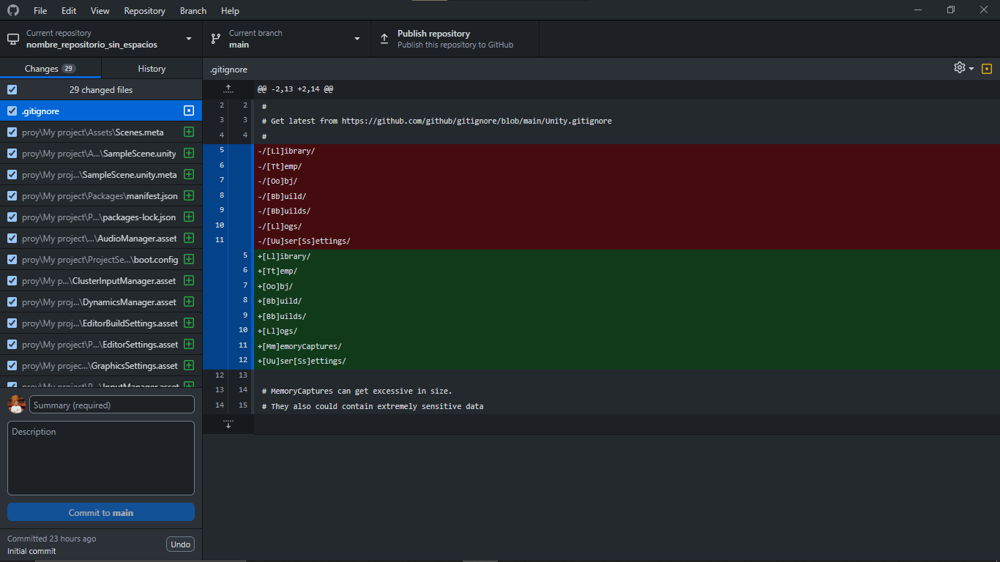
Estos cambios son los siguientes:
    * Cambios hechos dentro de archivo .gitignore
    * Proyecto de Unity

    **Nota: Es muy importante notar que en un proyecto nuevo y sin ninguna modificacion no se tienen que subir mas de 50 archivos o cambios. Si este no es el caso, revisa la configuracion del archivo .gitignore**

    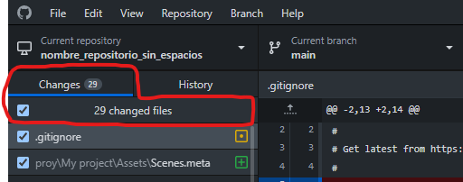

7. Cuando ya esté todo lo anterior correctamente, tendremos que crear un commit (acción que registra los cambios realizados en un repositorio). Esto lo haremos dándole un título y una descripción.

    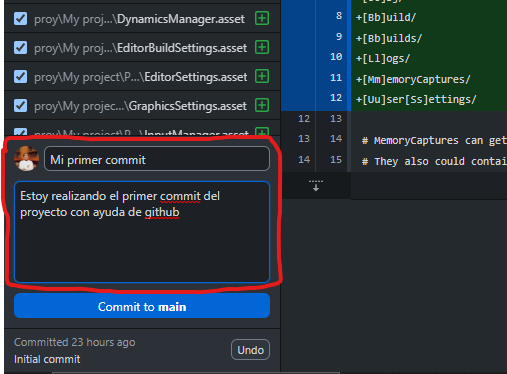

    **Esta es la forma correcta para crear un commit:**
    
    Título del commit:

    * Debe ser breve y descriptivo.
    * Puede comenzar con un verbo en infinitivo, como "Agregar", "Actualizar" o "Corregir".
    * Evita utilizar letras mayúsculas o caracteres especiales, a menos que sea necesario.
    
    Descripción del commit:

    * Proporciona detalles adicionales sobre los cambios realizados.
    * Explica por qué se realizaron los cambios y qué impacto tienen.
    * Si es necesario, incluye referencias a problemas (issues) o solicitudes de extracción relacionadas.
    * Utiliza viñetas o párrafos cortos para que la descripción sea fácil de leer.

    Después de esto, daremos clic en el botón de "Commit to main". Esto creará el primer commit del proyecto.

    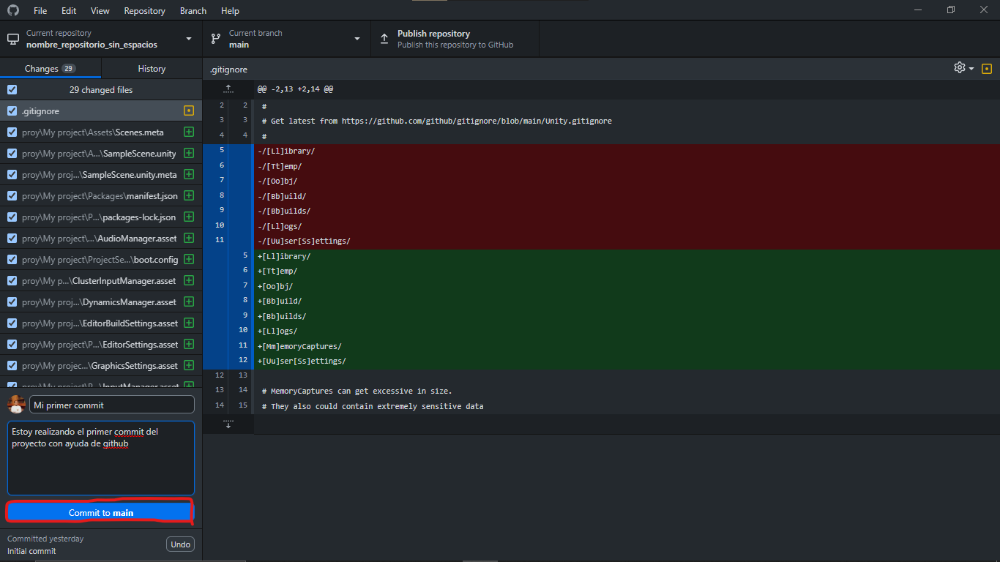

    Después de dar clic, se actualizará y nos mastrará esta nueva información. Nota estas dos nuevas secciónes:

    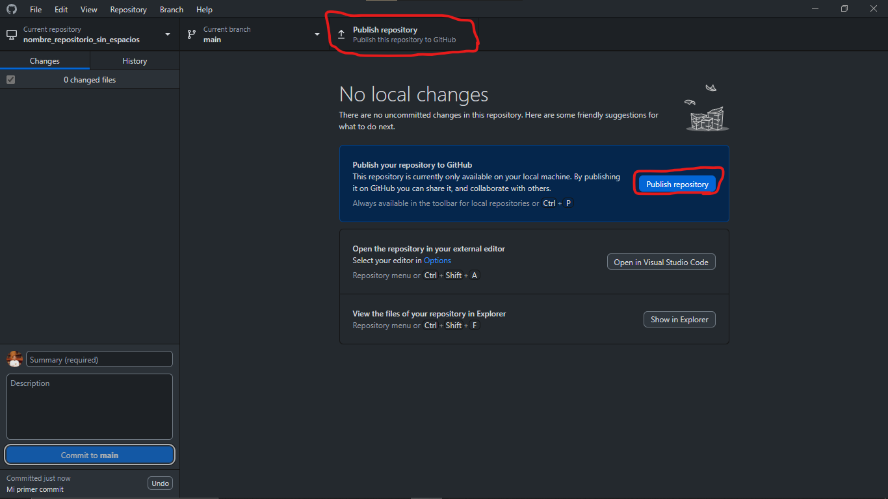

8. Ahora publicaremos el repositorio en nuestra cuenta de GitHub. Esto lo vamos a hacer de dando clic en el botón "Publish repository" y nos aparecerá esta nueva ventana:

    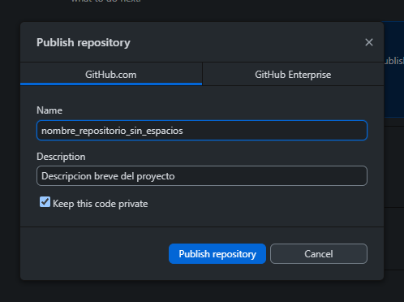
    
    Aquí aparecerá el nombre de nuestro repositorio y su descripción. Estas las puedes modificar si así lo deseas. La recomendación es que la dejen tal como está.

    Al finalizar solo daremos clic en "Publish repository"

    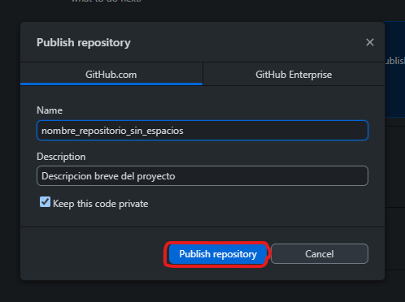

    Les tendrá que aparecer su pantalla de esta manera:

    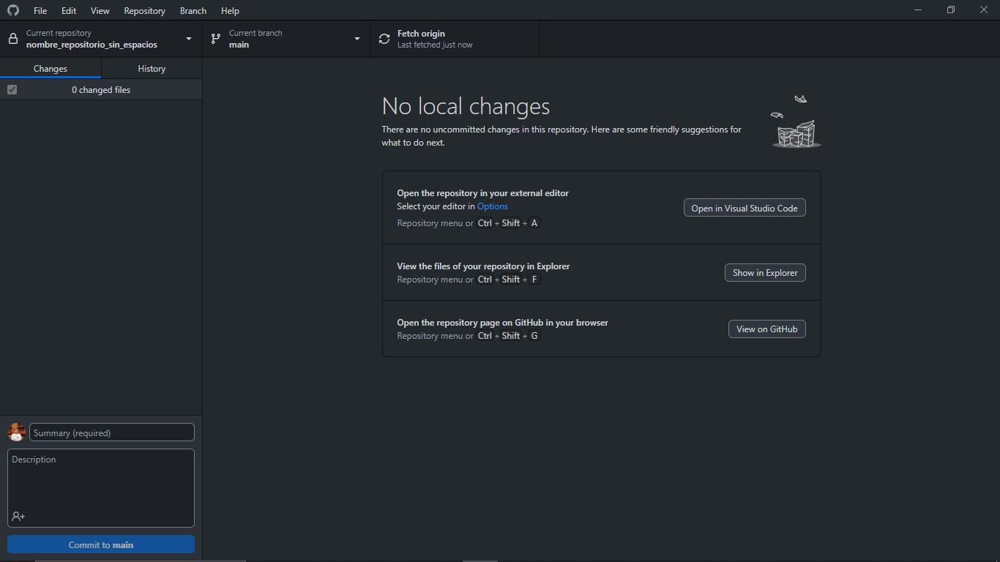

    Así nos daremos cuenta que ya está en la nube nuestro proyecto.

**Para ver nuestro repositorio en GitHub lo único que tendremos que hacer es iniciar sesión en GitHub e ir a nuestro perfil**

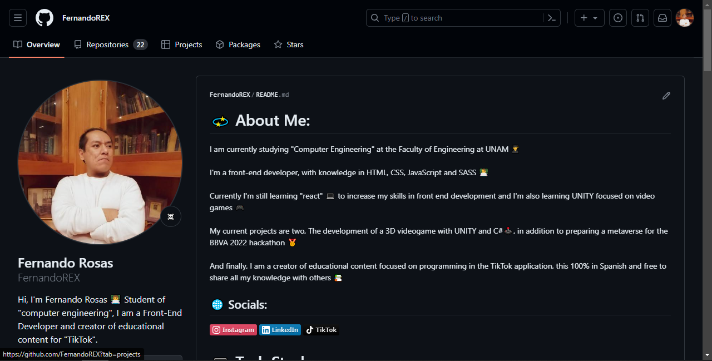

**Daremos clic en la sección de "Repositories" y podremos ver el repositorio que hicimos**

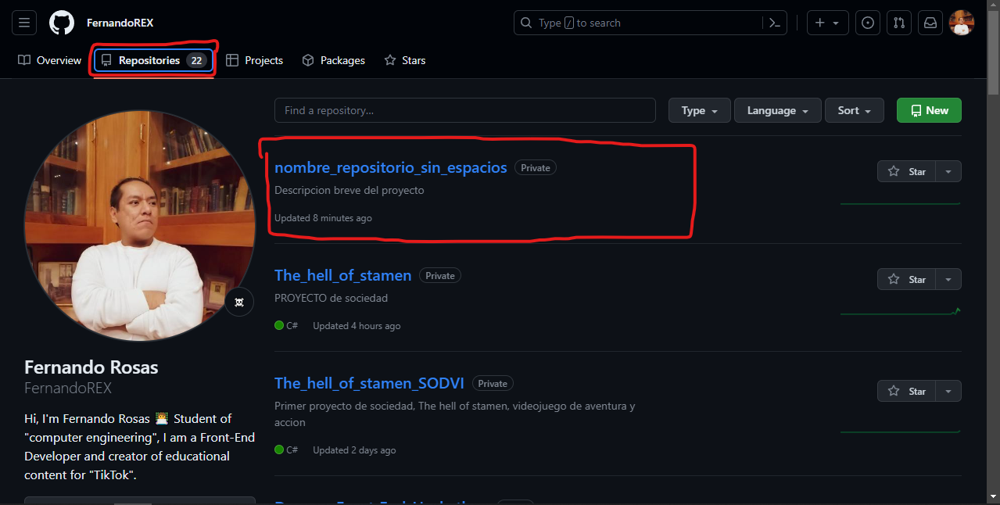

Listo!!!! 👾🤖 Ya tenemos en linea tu proyecto de UNITY!!!!

## Trabajar con un repositorio vinculado a Unity 🎮
Ahora que has creado y publicado tu repositorio en GitHub, es hora de comenzar a trabajar en tu proyecto de Unity y realizar cambios en él. A continuación, se muestra cómo puedes trabajar de manera efectiva con tu repositorio vinculado a Unity:

### Clonar el repositorio
Para comenzar a trabajar en tu proyecto de Unity, necesitarás clonar el repositorio desde GitHub a tu entorno de desarrollo local. Sigue estos pasos para clonar el repositorio:
1. Abre GitHub y selecciona el repositorio que creaste previamente.
2. Haz clic en el botón "Code" y luego selecciona "Open with GitHub Desktop".

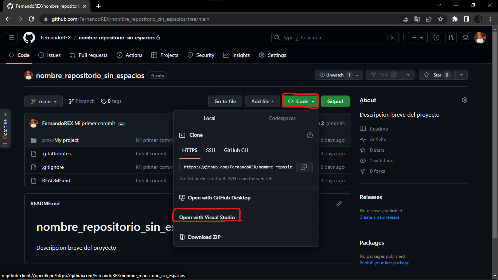

3. Elige una ubicación en tu computadora donde deseas clonar el repositorio.
4. Haz clic en "Clone" para completar el proceso de clonación.

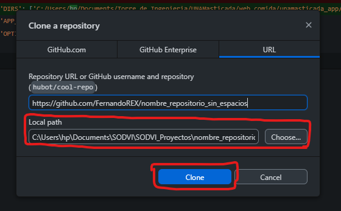
### Abrir el proyecto de Unity
Una vez que hayas clonado el repositorio, puedes abrir el proyecto de Unity en tu entorno de desarrollo. Sigue estos pasos para abrir el proyecto:

1. Abre Unity Hub, selecciona la pestaña "Projects" y haz clic en "Open".
2. Navega hasta la ubicación donde clonaste el repositorio y selecciona la carpeta del proyecto de Unity.
3. Haz clic en "Open" para abrir el proyecto en Unity.

### Realizar cambios y guardar💾

Ahora estás listo para trabajar en tu proyecto de Unity y realizar cambios en los archivos. Puedes agregar, modificar o eliminar archivos según sea necesario para tu desarrollo. Asegúrate de guardar los cambios regularmente mientras trabajas en el proyecto.

### Realizar commits de los cambios 📚
Después de hacer modificaciones en tu proyecto de Unity, es importante realizar commits para registrar los cambios en tu repositorio. Sigue estos pasos para hacer commits de los cambios:

1. Vuelve a GitHub Desktop y verás los archivos modificados que deseas incluir en el commit (Si es necesario los puedes modificar).
2. Proporciona un título descriptivo para el commit y una descripción detallada de los cambios realizados.
3. Haz clic en "Commit to main" para realizar el commit de los cambios.
### Subir los cambios al repositorio remoto
Una vez que hayas realizado los commits de los cambios en tu repositorio local, debes subirlos al repositorio remoto en GitHub. Sigue estos pasos para subir los cambios:

1. En GitHub Desktop, haz clic en el botón "Push origin" para enviar los commits al repositorio remoto.
2. Esto sincronizará tu repositorio local con el repositorio remoto y subirá los cambios realizados.

### Colaborar en el proyecto🎎

Si estás trabajando en un proyecto en equipo, es esencial tener una buena estrategia de colaboración para evitar conflictos y organizar eficientemente el trabajo. A continuación, te mostraré cómo crear ramas desde la web de GitHub y cómo trabajar de forma correcta:

**Crear ramas desde la web de GitHub**

1. Abre la página de tu repositorio en GitHub.
2. Haz clic en el menú desplegable que muestra la rama actual (por lo general, "main" o "master").
3. Escribe un nombre para tu nueva rama en el campo de texto.
4. Elige si deseas crear la rama a partir de "main" u otra rama existente.
5. Haz clic en el botón "Create branch" para crear la nueva rama.

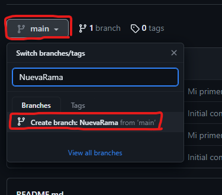

Una vez que hayas creado la nueva rama, puedes trabajar en ella sin afectar la rama principal del proyecto. Esto te permite desarrollar nuevas características, solucionar problemas o realizar cambios sin interferir con el trabajo de otros colaboradores.

**Trabajar de forma correcta**

Al trabajar en un proyecto colaborativo, es importante seguir algunas buenas prácticas para mantener un flujo de trabajo ordenado y evitar problemas. Aquí hay algunas recomendaciones:

* Antes de comenzar a trabajar en tu rama, asegúrate de que esté actualizada con los últimos cambios realizados por otros colaboradores. Para hacerlo, puedes ejecutar un "Pull" en GitHub Desktop o utilizar comandos de Git en tu terminal local.

* Realiza tus cambios y desarrollos en la rama específica que has creado para esa tarea o función. Evita trabajar directamente en la rama principal ("main" o "master") para evitar conflictos con otros colaboradores.

* Realiza commits frecuentes y con mensajes descriptivos para registrar los cambios de forma clara. Esto facilitará la comprensión de los cambios realizados y ayudará en caso de necesitar deshacerlos o revisar el historial del proyecto.

* Siempre antes de subir tus cambios, realiza un "Pull" nuevamente para asegurarte de tener los cambios más recientes de la rama principal. Esto te permitirá fusionar los cambios antes de subir los tuyos.

* Una vez que hayas actualizado tu rama local con los cambios más recientes de la rama principal, puedes realizar un "Push" para subir tus cambios al repositorio remoto.

* Siempre verifica que tus cambios no introduzcan errores o rompan la funcionalidad existente realizando pruebas adecuadas antes de realizar el "Push" final.

* Cuando hayas completado tu trabajo en la rama y estés listo para integrar tus cambios en la rama principal, puedes crear una solicitud de extracción (pull request) en GitHub. Esto permitirá revisar y discutir los cambios con otros colaboradores antes de fusionarlos con la rama principal.

* Siguiendo estas recomendaciones, podrás colaborar de manera efectiva en el proyecto, evitar conflictos y mantener un historial limpio de cambios. La colaboración en equipo se facilita al utilizar ramas separadas para cada tarea o función, lo que permite un desarrollo paralelo y un mejor control sobre los cambios realizados.

<!-- Cuando entregues tu documentación, por favor, borra todo lo que esté debajo. -->

 
 
 
 

  

<h3 align="center">Documentado por Fernando Rosas</h3>

