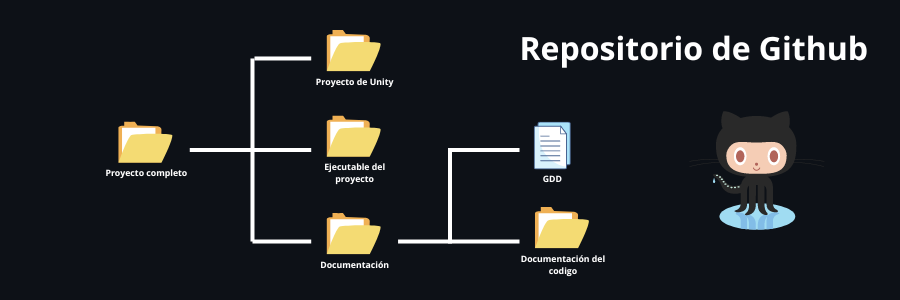
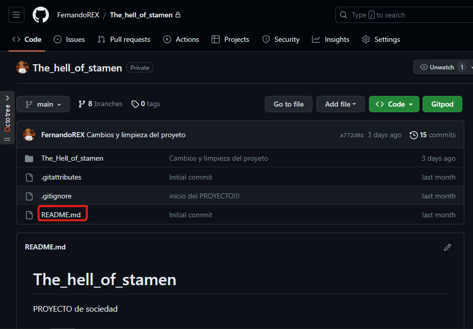
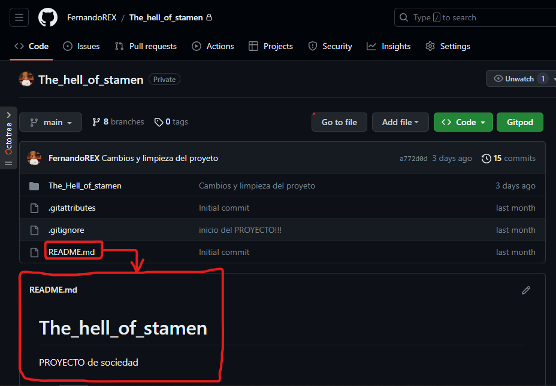
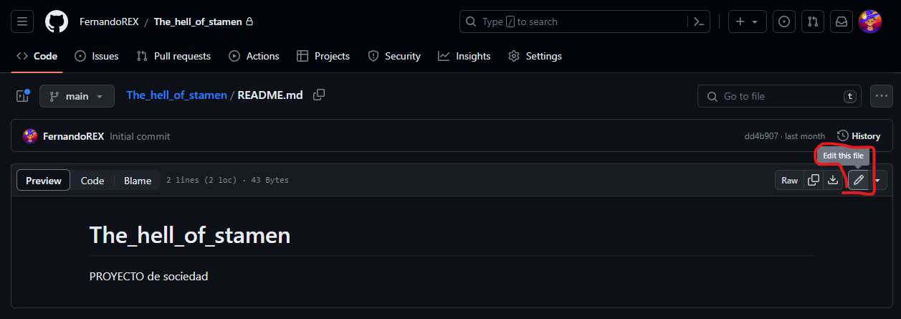
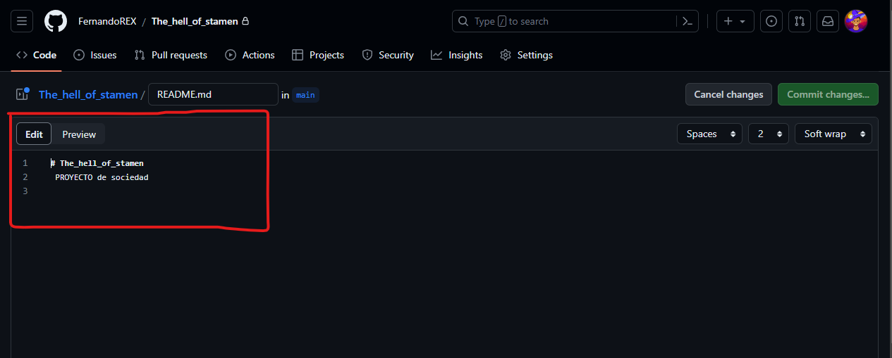
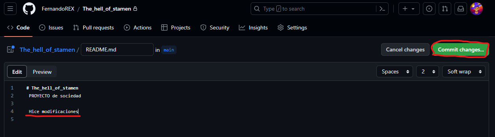
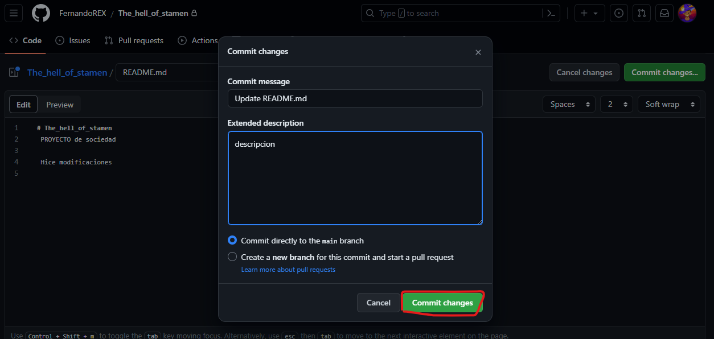

# Titulo

## Introduccion

## Formato de entrega del proyecto 📚

Los proyectos tienen que cumplir con las siguientes caracteristicas para su entrega:

* El proyecto se tendra que entregar en su totalidad dentro del repositorio de Github, el repositorio tendra que tener el titulo de dicho proyecto

* Dentro del repositorio sera necesario que tengas un README con la siguiente informacion:
    * **Titulo del proyecto**
    * **Numero de equipo y nombre completo de los integrantes (Solo integrantes que aportaron al proyecto)**
    * **Semestre el cual se realizo el proyecto**
    * **Nivel del juego en la torre de niveles**
    * Introducción
    * **Descripcion del proyecto**
    * 5 imagenes del proceso de trabajo con su respectiva descripcion del proyecto
    * Conclusión

    Tienes una plantilla del README que puedes descargar y llenar [aquí]()

* Tienes que anexar en el repositori el ejecutable de tu juego en formato .rar o .zip, este dontro de una carpeta de nombre "Ejecutable de |Nombre del juego|"

* Se necesita toda la documentacion del proyecto, esto incluye el GDD(Game Document Design) y la documetacion de sus codigos

* Ademas es necesario tambien entregar el proyecto de Unity completo

* En el repositorio tendras que tener la siguiente organizacion:
    

## Modificando el README 📖🖋
**Cunado creamos el repositorio se creo un documento llamado "README.md" en este documento es donde estara la informaion necesaria para la entrega de proyectos**

El "README.md" se puede ver en la parte inferior del repositorio, 

Para la entrega del proyecto es necesario que tenga cierta informacion. Para eso es necesario que modifiquemos el archivo, eso lo podemos hacer de la siguiente manera:

1. Encuentra el archivo README: Busca el archivo README en la lista. Normalmente se llama "README.md" y está ubicado en la raíz del repositorio. Haz clic en el nombre del archivo para abrirlo.

2. Editar el archivo README: Una vez que estés en la vista del archivo README, verás un botón en forma de lapiz en la esquina superior derecha del contenido del archivo. Haz clic en ese botón para entrar en modo de edición.

3. Realiza las modificaciones: Ahora estarás en el modo de edición del archivo README. Aquí puedes modificar el contenido utilizando el editor de texto proporcionado por GitHub. Puedes agregar texto, eliminar secciones, cambiar el formato y realizar otras modificaciones según tus necesidades.

4. Realiza un commit de los cambios: Después de realizar las modificaciones, desplázate hacia el área de "Commit changes" (Confirmar cambios). Proporciona un título descriptivo para los cambios que has realizado en el campo "Commit changes" y, opcionalmente, proporciona una descripción más detallada en el campo "Add an optional extended description..." (Agregar una descripción extendida opcional). Asegúrate de que la opción "Commit directly to the main branch" (Confirmar directamente en la rama principal) esté seleccionada.

5. Guarda los cambios: Haz clic en el botón verde "Commit changes" (Confirmar cambios) para guardar tus modificaciones en el archivo README.

¡Eso es todo! Has modificado con éxito el archivo README en la web de GitHub. Ahora, cuando vuelvas a la vista del repositorio, podrás ver los cambios reflejados en el archivo README. Recuerda que también puedes clonar el repositorio en tu computadora local, modificar el archivo README utilizando un editor de texto de tu elección y luego realizar un "push" para aplicar los cambios en GitHub si prefieres trabajar en tu entorno local.

